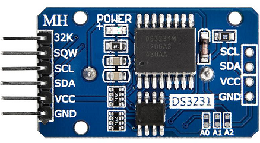
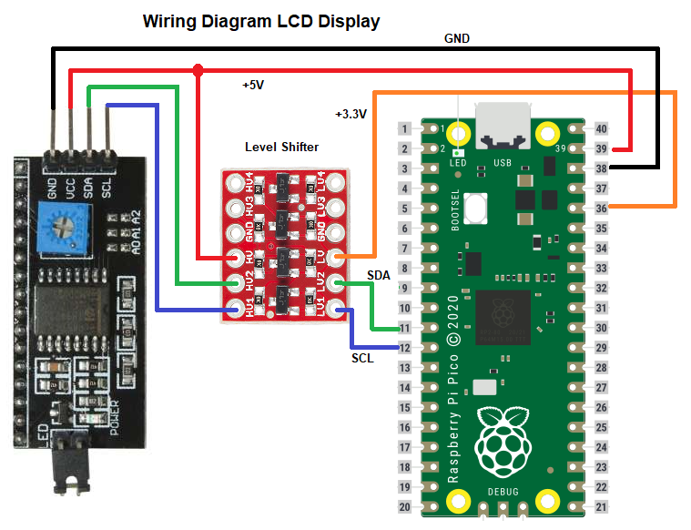

🏠 [Main Page](../README.md) 
>##  DS3231 Extremely Accurate RTC Example

Example reads DS3231 RTC and sets Pico RTC. 
If DS3231 RTC not set, user date and time are set. 
Date and time of Pico RTC are printed to lcd. 

### DS3231 RTC Module 
 

### Wiring Diagram LCD 
 
